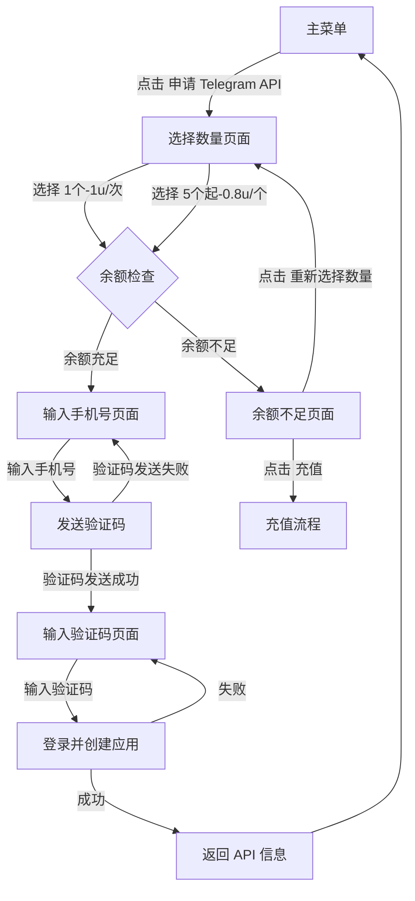
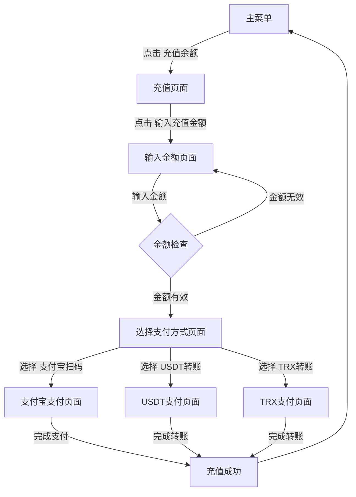
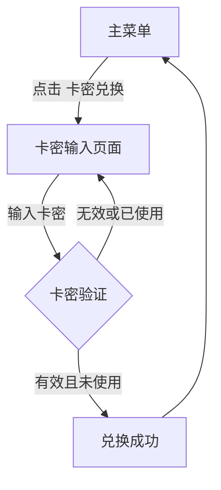
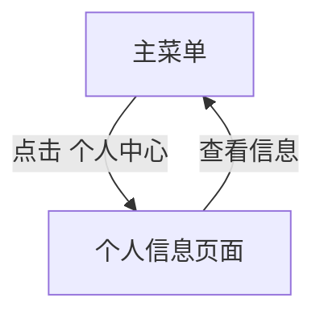

# Telegram API 申请机器人 2.0 使用文档

## 1. 机器人功能介绍

Telegram API 申请机器人是一个用于帮助用户快速申请 Telegram API 的自动化工具。机器人支持中文和英文双语言切换，提供了以下功能：

- 📱 申请 Telegram API
- 💰 余额管理
- 💳 充值功能（支持支付宝、USDT、TRX）
- 🎫 卡密兑换
- 👤 个人中心
- ❓ 帮助说明
- 📞 联系客服
- 🌐 语言设置

## 2. 快速开始

### 2.1 启动机器人

1. 向机器人发送 `/start` 命令
2. 选择您的语言（中文或英文）
3. 进入主菜单

### 2.2 主菜单

主菜单包含以下按钮：

- 📱 申请 Telegram API
- 👤 个人中心
- 💳 充值余额
- 🎫 卡密兑换
- ❓ 帮助说明
- 📞 联系客服
- 🌐 语言设置

## 3. 功能使用流程

### 3.1 申请 Telegram API

**流程图：**



**详细步骤：**

1. 在主菜单点击 "📱 申请 Telegram API"
2. 选择申请数量（1个或5个）
3. 系统检查余额是否充足
   - 如果余额充足，扣除相应费用
   - 如果余额不足，提示充值
4. 输入手机号（国际格式，如 +8613800000000）
5. 接收 Telegram 发送的验证码
6. 输入验证码
7. 系统自动登录并创建应用
8. 接收 api_id 和 api_hash

### 3.2 充值余额

**流程图：**



**详细步骤：**

1. 在主菜单点击 "💳 充值余额"
2. 点击 "💵 输入充值金额"
3. 输入充值金额（1-9999u）
4. 选择支付方式（支付宝、USDT、TRX）
5. 根据提示完成支付
6. 系统自动到账

### 3.3 卡密兑换

**流程图：**



**详细步骤：**

1. 在主菜单点击 "🎫 卡密兑换"
2. 输入卡密
3. 系统验证卡密
4. 卡密有效则自动充值到账户

### 3.4 个人中心

**流程图：**



**详细步骤：**

1. 在主菜单点击 "👤 个人中心"
2. 查看个人信息（TG ID、用户名、余额、累计充值、累计申请）
3. 点击 "🔙 返回菜单"

## 4. 多语言支持

机器人支持中文和英文双语言切换：

1. 在主菜单点击 "🌐 语言设置"
2. 选择 "🇨🇳 中文" 或 "🇺🇸 English"
3. 系统会保存您的语言偏好

## 5. 常见问题

### 5.1 验证码收不到
- 确保手机号已注册 Telegram
- 检查手机号格式是否正确（国际格式，如 +8613800000000）
- 尝试重新发送验证码

### 5.2 余额不足
- 点击 "💳 充值余额" 进行充值
- 或使用卡密兑换

### 5.3 API 申请失败
- 可能是手机号已达到每日申请上限
- 可能是网络问题，稍后重试

## 6. 联系客服

如果遇到问题，可以在主菜单点击 "📞 联系客服" 与客服取得联系。

## 7. 后台管理

机器人配备了后台管理页面，用于管理用户、订单、卡密等信息。

### 7.1 启动后台管理

```bash
python admin.py
```

### 7.2 管理功能

- 用户管理：查看和管理用户信息
- 订单管理：查看充值订单
- 卡密管理：生成和管理卡密
- API 申请记录：查看 API 申请历史

## 8. 技术说明

- 机器人基于 Python 和 python-telegram-bot 库开发
- 使用 SQLite 数据库存储数据
- 支持多语言国际化
- 支持多种支付方式

## 9. 更新日志

### v2.0
- ✨ 新增多语言支持（中文/英文）
- ✨ 新增充值系统
- ✨ 新增卡密兑换功能
- ✨ 新增个人中心
- ✨ 优化用户界面，添加图标
- ✨ 移除订单口令功能
- ✨ 新增后台管理页面

---

**注意：** 本机器人仅用于帮助用户申请 Telegram API，请勿用于其他用途。
